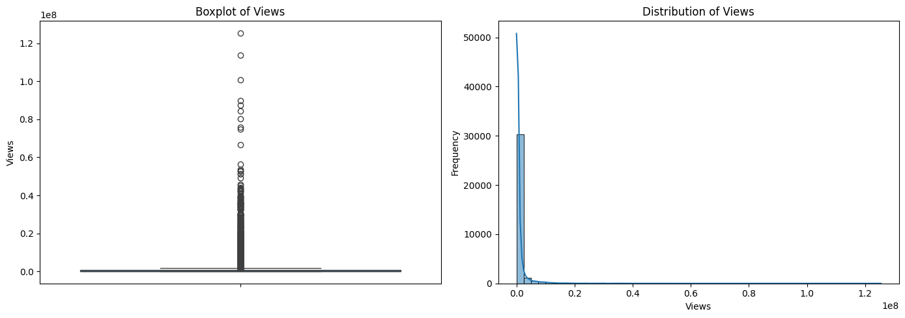
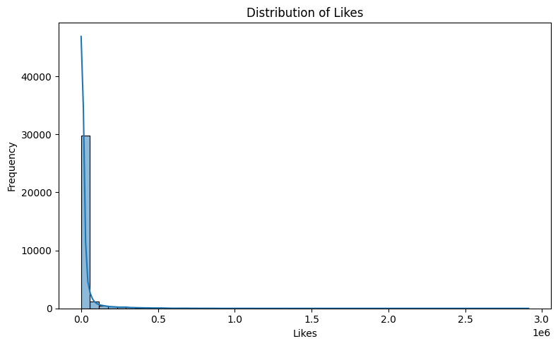
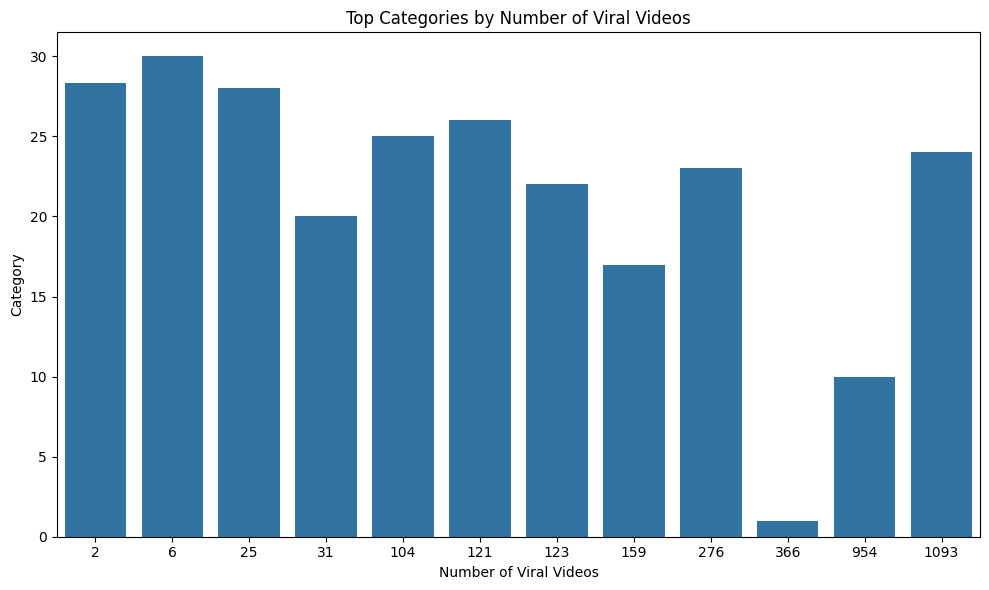
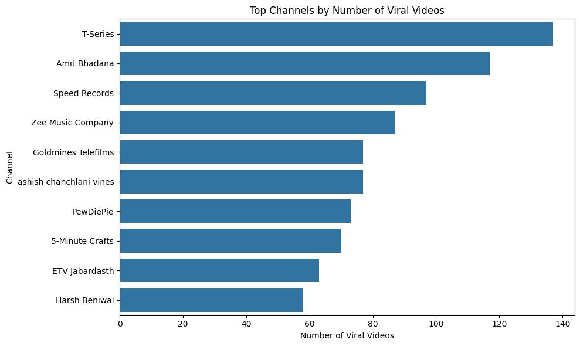
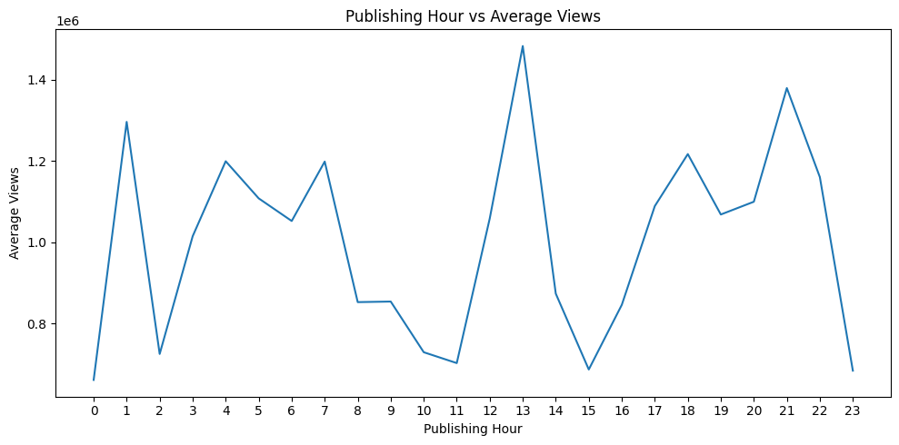
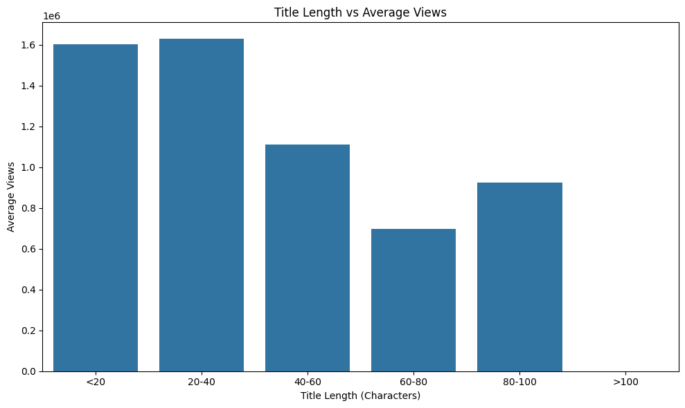
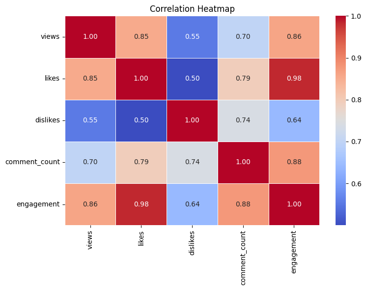

# YouTube Virality Analysis

A data analysis project focused on identifying the factors associated with YouTube video virality using Python, Pandas, and exploratory data analysis techniques.

## Table of Contents
- [Project Overview](#project-overview)
- [Business Problem](#business-problem)
- [Project Objectives](#project-objectives)
- [Dataset](#dataset)
- [Data Cleaning and Preparation](#data-cleaning-and-preparation)
- [Methodology](#methodology)
- [Feature Engineering](#feature-engineering)
- [Exploratory Data Analysis](#exploratory-data-analysis)
- [Key Insights](#key-insights)
- [Business Recommendations](#business-recommendations)
- [Tech Stack](#tech-stack)
- [Project Structure](#project-structure)
- [How to Run](#how-to-run)
- [Project Limitations](#project-limitations)
- [Skills Demonstrated](#skills-demonstrated)
- [Author](#author)

---

## Project Overview
This project analyzes YouTube trending-video data to understand what drives video performance and virality. The analysis combines data cleaning, preprocessing, validation, feature engineering, outlier detection, and exploratory data analysis to uncover patterns in views, likes, dislikes, comments, publishing time, title characteristics, and engagement behavior.

The project is designed to answer practical business and product questions around content performance, and it demonstrates an end-to-end analytics workflow suitable for real-world data analysis projects.

---

## Business Problem
YouTube content performance is influenced by many factors, including audience interaction, publication timing, content category, and channel strength. However, raw performance metrics alone do not explain *why* certain videos outperform others.

This project addresses that problem by analyzing trending-video data to identify the measurable characteristics that are commonly associated with highly viewed and highly engaged videos.

---

## Project Objectives
The main objective is to identify patterns linked to viral video performance and audience engagement.

### Key Questions Answered
- Which videos receive the highest number of views?
- How long do videos remain in the trending list?
- Which videos trend on the same day they are published?
- Which categories are more strongly associated with viral videos?
- Which channels repeatedly produce high-performing videos?
- How does publishing hour affect views and engagement?
- How does publishing day affect video performance?
- Is title length associated with views or engagement?
- How are likes, dislikes, and comments related to views?
- Do disabled comments or ratings appear to be associated with lower performance?

---

## Dataset
The dataset contains YouTube trending-video observations and includes fields such as:

- `video_id`
- `title`
- `channel`
- `category`
- `views`
- `likes`
- `dislikes`
- `comment_count`
- `trending_date`
- `publish_date`
- `publish_time`
- `description`
- comment/rating status indicators
- removed/error status flags

### Dataset Summary
- **Raw dataset size:** 37,351 rows × 16 columns
- **Duplicate rows removed:** 4,263
- **Rows with missing descriptions removed:** 527
- **Final dataset size:** 32,561 rows
- **Valid unique video IDs identified:** 16,307

### Data Sources
- **Raw dataset:** https://query.data.world/s/evaqrt2zzlif7stoa53otaysb6ybwk
- **Processed dataset:** https://www.kaggle.com/datasets/samiajahanilma/youtube-web-scraped-dataset?select=unique_youtube_df_valid.csv

---

## Data Cleaning and Preparation
A structured preprocessing workflow was applied before analysis:

- Converted date and time-related columns into appropriate datetime formats
- Extracted additional temporal features such as publishing hour and publishing day
- Removed duplicate observations
- Investigated missing values and removed rows with missing descriptions where necessary
- Validated YouTube video IDs using regular expressions to retain only IDs matching the expected 11-character format
- Reset indexes after filtering to maintain a clean DataFrame structure

This step ensured the dataset was analysis-ready and reduced noise from invalid identifiers, duplicate observations, and incomplete records.

---
## Requirements

To run this project, install the dependencies listed in `requirements.txt`:
pip install -r requirements.txt

## Methodology

### Views Distribution


### Likes Distribution


### 1. Distribution and Skewness Analysis
The distributions of the following variables were examined:

- `views`
- `likes`
- `dislikes`
- `comment_count`

These variables were strongly right-skewed, which is expected in social media performance data where a small number of videos receive exceptionally high attention.

### 2. Outlier Detection
Because the key numeric variables were skewed rather than normally distributed, the **Interquartile Range (IQR)** method was used to detect outliers.

Outliers were intentionally retained because unusually high-performing videos are central to the study of virality and should not be removed as noise.

### 3. Virality Definition
The dataset does not include a predefined `viral` label. To create a consistent analytical framework, this project defines a viral video as:

> **A video whose views are in the top 10% of the dataset**

Formally:

`viral = views >= 90th percentile of views`

This project-specific definition allows structured comparison across categories, channels, publishing patterns, and title characteristics.

---

## Feature Engineering
Several derived features were created to deepen the analysis:

- **Engagement** = `likes + dislikes + comment_count`
- **Engagement Rate** = `engagement / views`
- **View-to-Comment Ratio** = `views / comment_count`
- **View-to-Like Ratio** = `views / likes`
- **Like-to-Dislike Ratio** = `likes / dislikes`
- **Title Length** = character length of video title
- **Publishing Hour** extracted from publishing timestamp
- **Publishing Day** extracted from publish date

These features helped evaluate not only raw reach, but also audience interaction quality and content characteristics.

---

## Exploratory Data Analysis

### Top Viewed Videos
Videos were grouped and ranked by maximum observed view count after validating video IDs. This identified the strongest-performing videos in the dataset.

### Trending Duration
The first and last observed trending dates were used to estimate how long a video remained in the trending dataset. This helped distinguish sustained popularity from short-term spikes.

### Same-Day Trending
Videos were analyzed to find cases where the publishing date matched the trending date. These observations indicate videos that gained visibility very quickly after release.

### Category Analysis
Categories were compared based on:
- number of viral videos
- average views
- engagement
- engagement rate

This highlighted which content groups were more strongly represented among top-performing videos.

### Viral Videos by Category


### Channel Analysis
Channels were analyzed to identify whether a smaller group of creators repeatedly appeared among high-performing videos.

### Viral Videos by Channel


### Publishing Time Analysis
Performance was compared across:
- publishing hour
- publishing day

This helped assess whether timing patterns were associated with higher views or stronger audience interaction.

### Publishing Hour vs Views


### Title Length Analysis
Titles were grouped by length ranges to examine whether longer or shorter titles were associated with performance differences.

### Title Length vs Views



### Correlation Analysis
Correlation was used to measure associations among:
- views
- likes
- dislikes
- comments
- title length
- comment/rating status indicators

The analysis was interpreted carefully as **association, not causation**.

### Correlation Heatmap


---

## Key Insights
The analysis produced several meaningful findings:

- Views, likes, dislikes, and comments are heavily right-skewed
- Likes contain the highest number of detected outliers
- Some videos remained trending for up to **8 consecutive days**
- Approximately **420** observations trended on the same day they were published
- Viral videos were concentrated within a relatively small number of categories
- A smaller group of channels appeared repeatedly among top-performing videos
- Publishing hour and publishing day showed differences in average views and engagement
- Title length showed limited or negative relationship with views and engagement
- Likes and comments showed meaningful positive association with views
- Videos with disabled comments or ratings tended to have lower observed view counts in this dataset

---

## Business Recommendations
Based on the findings, the following recommendations can be considered for content strategy and performance optimization:

1. **Optimize publishing schedules**  
   Use historical performance trends to identify time windows associated with stronger reach and engagement.

2. **Benchmark high-performing categories**  
   Categories with stronger viral concentration can provide guidance for topic selection and content strategy.

3. **Focus on engagement, not views alone**  
   Track engagement rate in addition to total views to better measure audience response quality.

4. **Encourage audience interaction**  
   Likes and comments are strongly associated with higher-performing videos and should be treated as strategic engagement metrics.

5. **Keep titles clear and relevant**  
   Title length alone did not drive performance, so clarity and relevance are more important than making titles longer.

6. **Evaluate performance across multiple dimensions**  
   Views, engagement, category, timing, and channel-level patterns together provide a more reliable understanding of video performance than any single metric.

---

## Tech Stack
- **Python**
- **Pandas**
- **NumPy**
- **Matplotlib**
- **Seaborn**
- **Google Colab**
- **Regular Expressions (Regex)**
- **Datetime Analysis**
- **Statistical Analysis**
- **Exploratory Data Analysis (EDA)**

---

## Project Structure

```bash
YouTube-Virality-Analysis/
│
├── data/
│   ├── raw/
│   └── processed/
│
├── notebooks/
│   └── youtube_virality_analysis.ipynb
│
├── images/
│   ├── correlation_heatmap.png
│   ├── likes_distribution.png
│   ├── publishing_hour_vs_views.png
│   ├── title_length_vs_views.png
│   ├── views_distribution.png
│   ├── viral_videos_by_category.png
│   └── viral_videos_by_channel.png
│
├── requirements.txt
└── README.md
```
---

## How to Run

### 1. Clone the repository
```bash
git clone <https://github.com/samiajahanilma/YouTube_Virality_Analysis>
```

### 2. Navigate to the project directory
```bash
cd YouTube-Virality-Analysis
```

### 3. Install required dependencies
```bash
pip install -r requirements.txt
```

### 4. Run the notebook
Open the notebook below in Jupyter Notebook or Google Colab:

```bash
notebooks/youtube_virality_analysis.ipynb
```

Run the cells sequentially to reproduce the analysis.

---

## Project Limitations
- This project identifies **patterns and associations**, not causal relationships
- The viral classification is **project-defined** as the top 10% of videos by views
- The dataset contains **trending-video observations only**, not the full population of YouTube videos
- Findings should be interpreted within the scope and limitations of the available dataset

---

## Skills Demonstrated
This project highlights the following analytics skills:

- Data cleaning and preprocessing
- Duplicate detection and missing value handling
- Datetime transformation and temporal analysis
- Regex-based data validation
- Skewness analysis and IQR-based outlier detection
- Feature engineering
- GroupBy aggregation and ranking
- Correlation analysis
- Engagement metric design
- Exploratory data analysis
- Business insight generation and analytical storytelling

---

## Author
**Samia Jahan Ilma**  
Data Analytics & Business Intelligence | Python | SQL | Pandas | Data Visualization
Github : https://github.com/samiajahanilma | LinkedIn : https://www.linkedin.com/in/samia-jahan-ilma/

---
